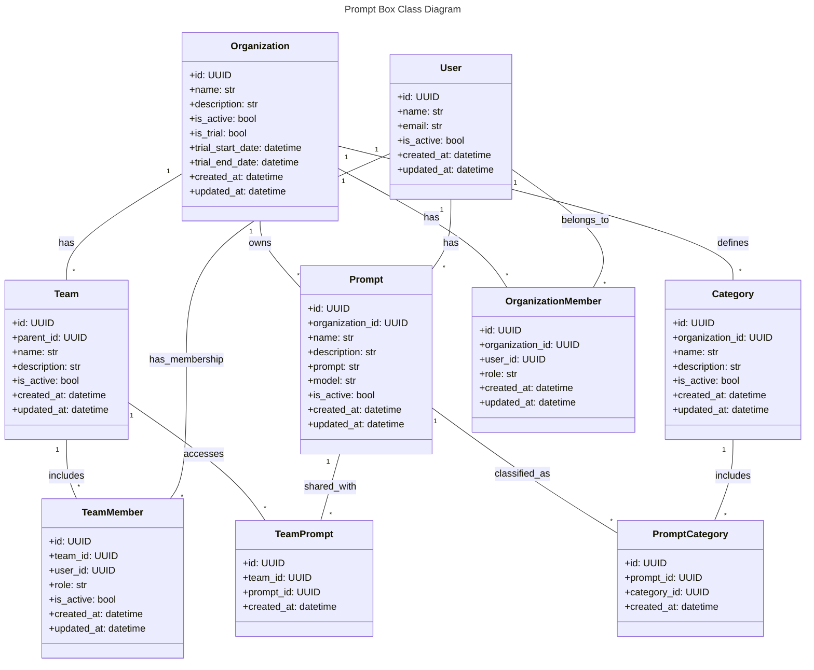

```mermaid

---
title: Prompt Box Class Diagram
---
classDiagram
  class Organization {
    +id: UUID
    +name: str
    +description: str
    +is_active: bool
    +is_trial: bool
    +trial_start_date: datetime
    +trial_end_date: datetime
    +created_at: datetime
    +updated_at: datetime
  }
  Organization "1" -- "*" Team : has
  Organization "1" -- "*" Prompt : owns
  Organization "1" -- "*" Category : defines
  Organization "1" -- "*" OrganizationMember : has

  class OrganizationMember {
    +id: UUID
    +organization_id: UUID
    +user_id: UUID
    +role: str
    +created_at: datetime
    +updated_at: datetime
  }

  User "1" -- "*" OrganizationMember : belongs_to

  class Team{
    +id: UUID
    +parent_id: UUID
    +name: str
    +description: str
    +is_active: bool
    +created_at: datetime
    +updated_at: datetime
  }
  class TeamMember {
    +id: UUID
    +team_id: UUID
    +user_id: UUID
    +role: str
    +is_active: bool
    +created_at: datetime
    +updated_at: datetime
  }
  Team "1" -- "*" TeamMember : includes
  User "1" -- "*" TeamMember : has_membership

  class TeamPrompt {
    +id: UUID
    +team_id: UUID
    +prompt_id: UUID
    +created_at: datetime
  }
  Team "1" -- "*" TeamPrompt : accesses
  Prompt "1" -- "*" TeamPrompt : shared_with

  class User{
    +id: UUID
    +name: str
    +email: str
    +is_active: bool
    +created_at: datetime
    +updated_at: datetime
  }
  User "1" -- "*" Prompt : has
  class Prompt {
    +id: UUID
    +organization_id: UUID
    +name: str
    +description: str
    +prompt: str
    +model: str
    +is_active: bool
    +created_at: datetime
    +updated_at: datetime
  }
  class PromptCategory {
    +id: UUID
    +prompt_id: UUID
    +category_id: UUID
    +created_at: datetime
  }
  Prompt "1" -- "*" PromptCategory : classified_as
  Category "1" -- "*" PromptCategory : includes

  class Category{
    +id: UUID
    +organization_id: UUID
    +name: str
    +description: str
    +is_active: bool
    +created_at: datetime
    +updated_at: datetime
  }
```