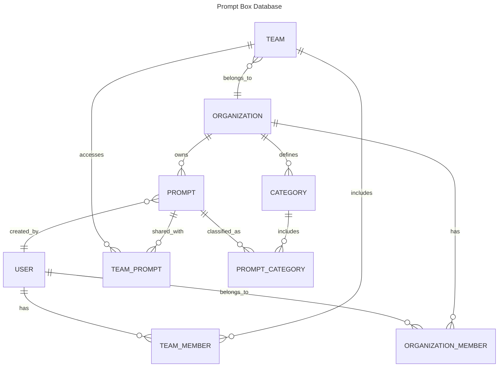

```mermaid

---
title: Prompt Box Database
---
erDiagram
    USER ||--o{ TEAM_MEMBER : has
    USER ||--o{ ORGANIZATION_MEMBER : belongs_to
    TEAM ||--o{ TEAM_MEMBER : includes
    TEAM }o--|| ORGANIZATION : belongs_to
    ORGANIZATION ||--o{ PROMPT : owns
    ORGANIZATION ||--o{ CATEGORY : defines
    ORGANIZATION ||--o{ ORGANIZATION_MEMBER : has
    TEAM ||--o{ TEAM_PROMPT : accesses
    PROMPT ||--o{ TEAM_PROMPT : shared_with
    PROMPT }o--|| USER : created_by
    PROMPT ||--o{ PROMPT_CATEGORY : classified_as
    CATEGORY ||--o{ PROMPT_CATEGORY : includes

```