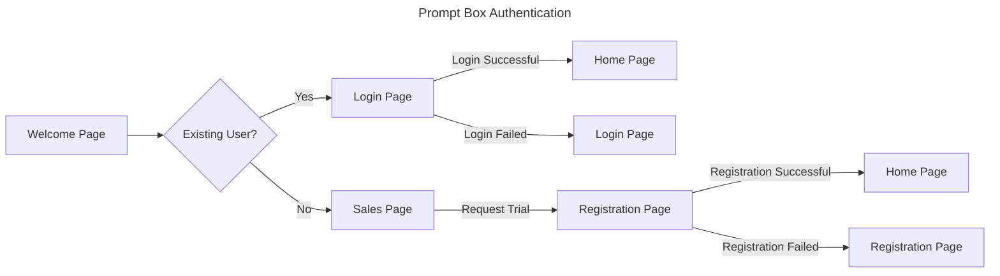

```mermaid

---
title: Prompt Box Authentication
---

flowchart LR
    A[Welcome Page] --> B@{shape: diamond, label: "Existing User?"}
    B -->| Yes | C[Login Page]
    B -->| No | D[Sales Page]
    C -->| Login Successful | E[Home Page]
    C -->| Login Failed | F[Login Page]
    D -->| Request Trial | G[Registration Page]
    G -->| Registration Successful | H[Home Page]
    G -->| Registration Failed | I[Registration Page]


```