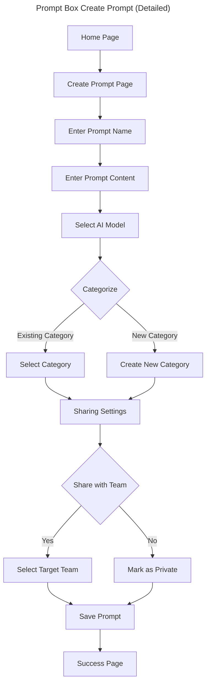

```mermaid

---
title: Prompt Box Create Prompt (Detailed)
---

flowchart TD
    A[Home Page] --> B[Create Prompt Page]
    B --> C[Enter Prompt Name]
    C --> D[Enter Prompt Content]
    D --> E[Select AI Model]
    E --> F{Categorize}
    F -->|Existing Category| G[Select Category]
    F -->|New Category| H[Create New Category]
    G --> I[Sharing Settings]
    H --> I
    I --> J{Share with Team}
    J -->|Yes| K[Select Target Team]
    J -->|No| L[Mark as Private]
    K --> M[Save Prompt]
    L --> M
    M --> N[Success Page]
```