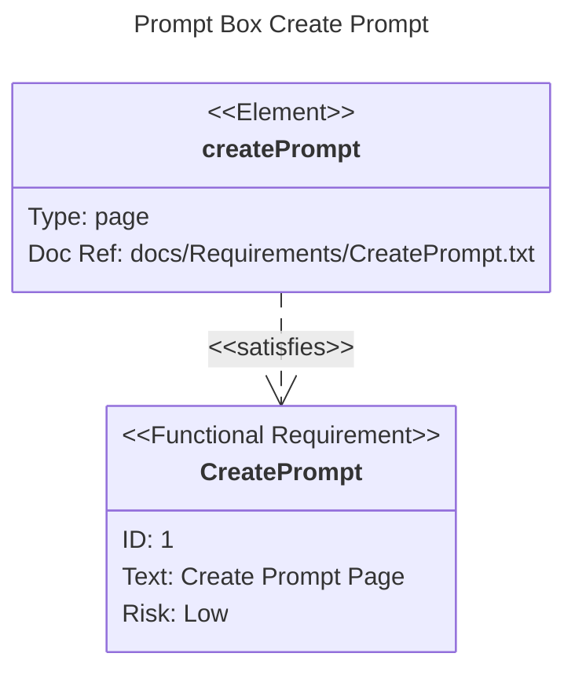

```mermaid

---
title: Prompt Box Create Prompt
---

requirementDiagram

functionalRequirement CreatePrompt{
  id: 1
  text: "Create Prompt Page"
  risk: low
}

element createPrompt{
  type: page
  docref: docs/Requirements/CreatePrompt.txt
}

CreatePrompt <- satisfies - createPrompt
```