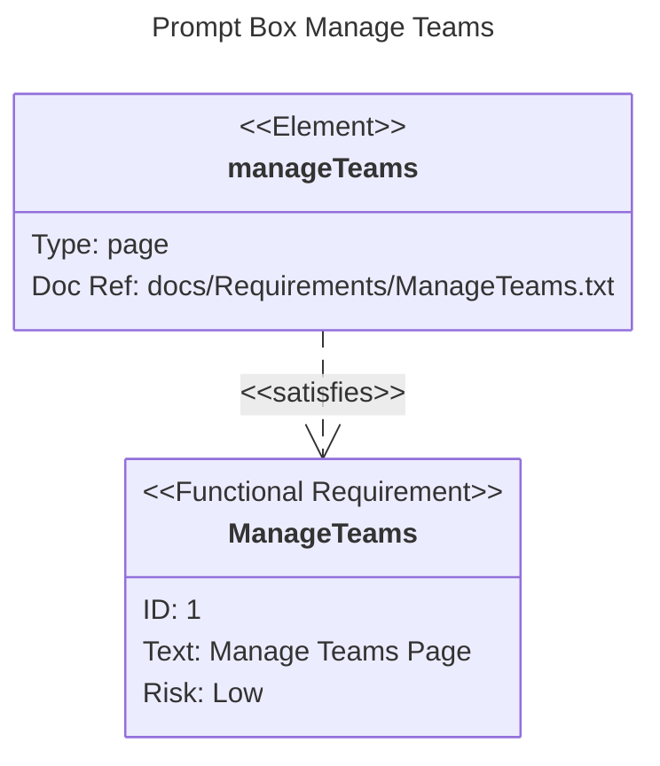

```mermaid

---
title: Prompt Box Manage Teams
---

requirementDiagram

functionalRequirement ManageTeams{
  id: 1
  text: "Manage Teams Page"
  risk: low
}

element manageTeams{
  type: page
  docref: docs/Requirements/ManageTeams.txt
}

ManageTeams <- satisfies - manageTeams
```