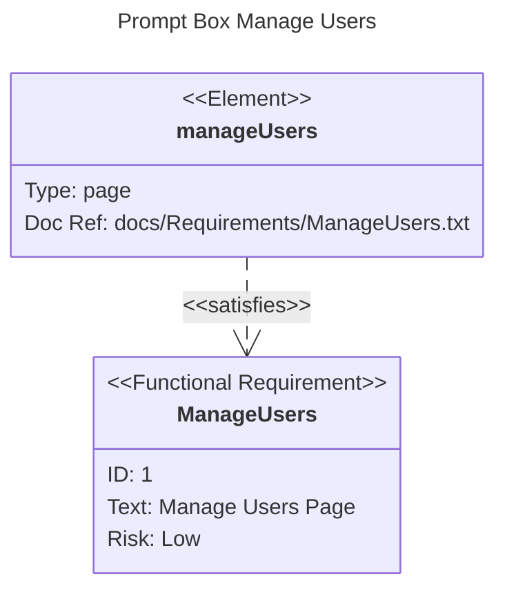

```mermaid

---
title: Prompt Box Manage Users
---

requirementDiagram

functionalRequirement ManageUsers{
  id: 1
  text: "Manage Users Page"
  risk: low
}

element manageUsers{
  type: page
  docref: docs/Requirements/ManageUsers.txt
}

ManageUsers <- satisfies - manageUsers
```