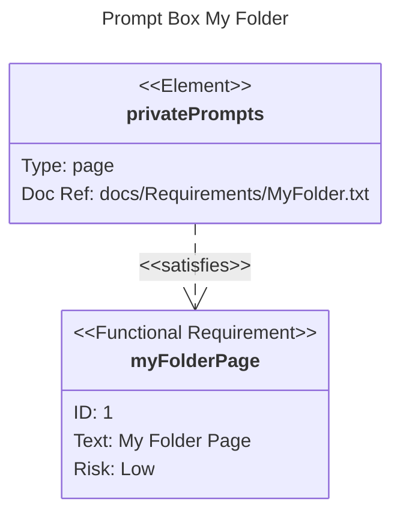

```mermaid

---
title: Prompt Box My Folder
---

requirementDiagram

functionalRequirement myFolderPage{
  id: 1
  text: "My Folder Page"
  risk: low
}

element privatePrompts{
  type: page
  docref: docs/Requirements/MyFolder.txt
}

myFolderPage <- satisfies - privatePrompts
```