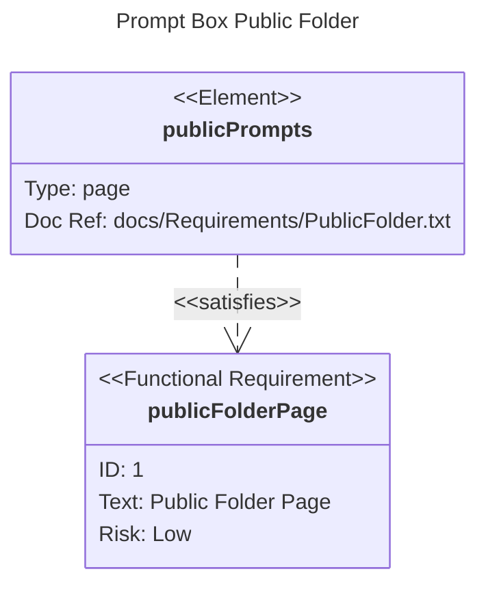

```mermaid

---
title: Prompt Box Public Folder
---

requirementDiagram

functionalRequirement publicFolderPage{
  id: 1
  text: "Public Folder Page"
  risk: low
}

element publicPrompts{
  type: page
  docref: docs/Requirements/PublicFolder.txt
}

publicFolderPage <- satisfies - publicPrompts
```