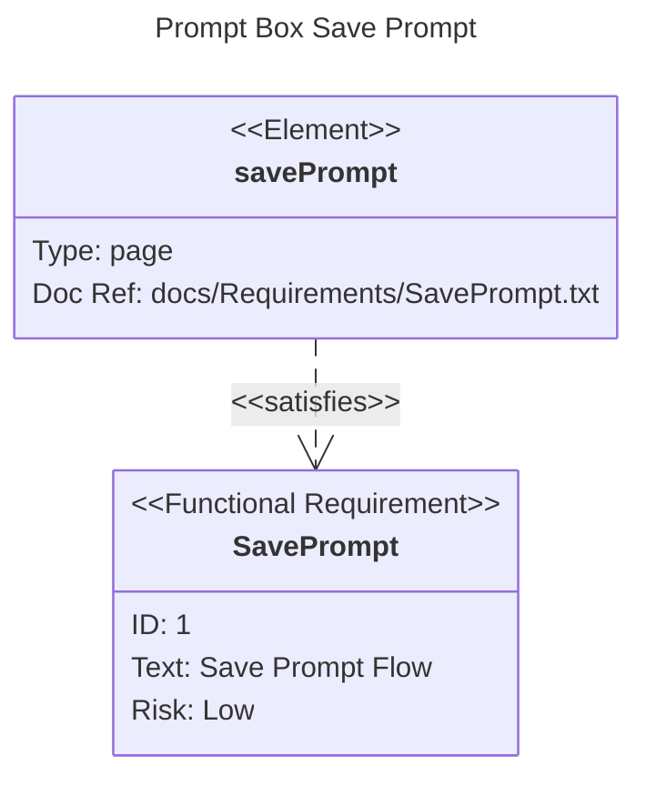

```mermaid

---
title: Prompt Box Save Prompt
---

requirementDiagram

functionalRequirement SavePrompt{
  id: 1
  text: "Save Prompt Flow"
  risk: low
}

element savePrompt{
  type: page
  docref: docs/Requirements/SavePrompt.txt
}

SavePrompt <- satisfies - savePrompt
```