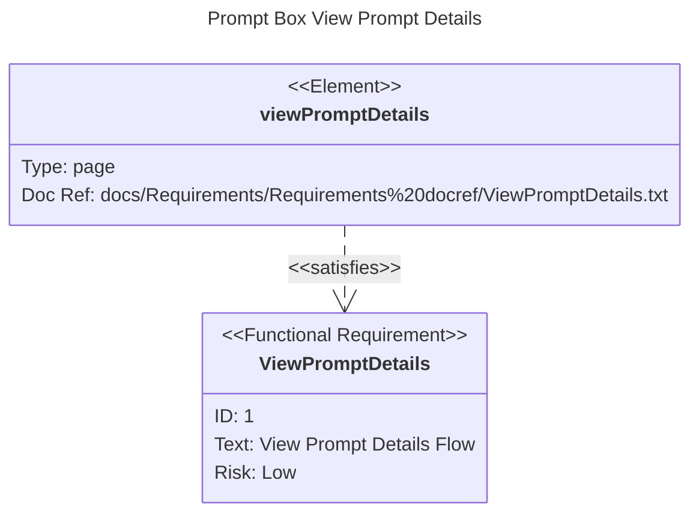

```mermaid

---
title: Prompt Box View Prompt Details
---

requirementDiagram

functionalRequirement ViewPromptDetails{
  id: 1
  text: "View Prompt Details Flow"
  risk: low
}

element viewPromptDetails{
  type: page
  docref: docs/Requirements/Requirements%20docref/ViewPromptDetails.txt
}

ViewPromptDetails <- satisfies - viewPromptDetails
```